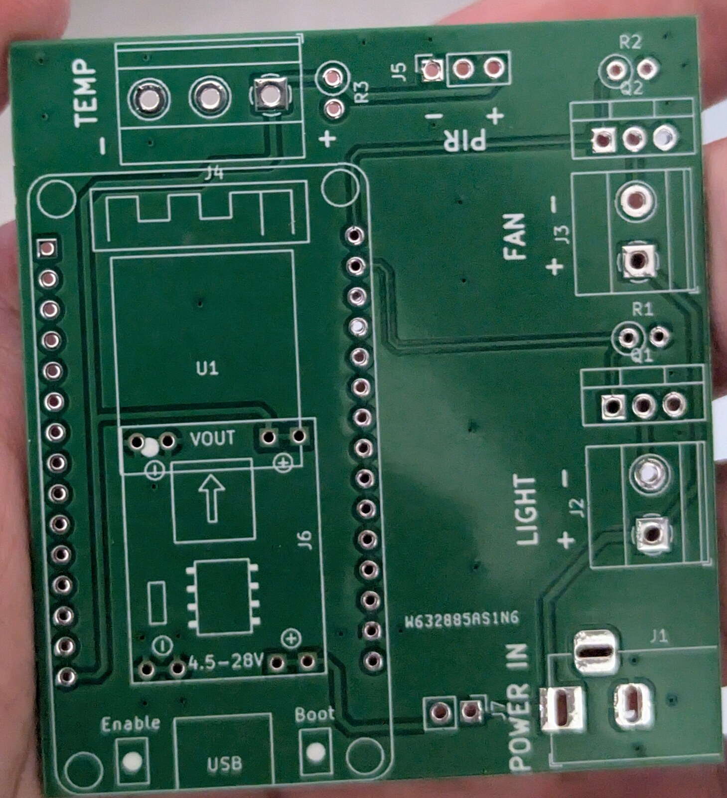
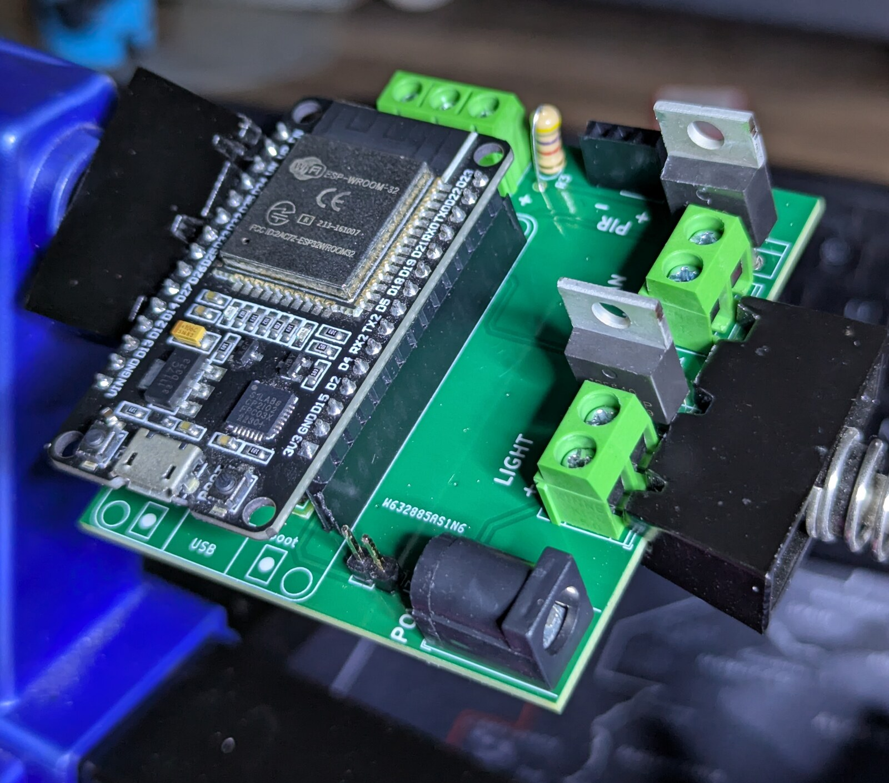
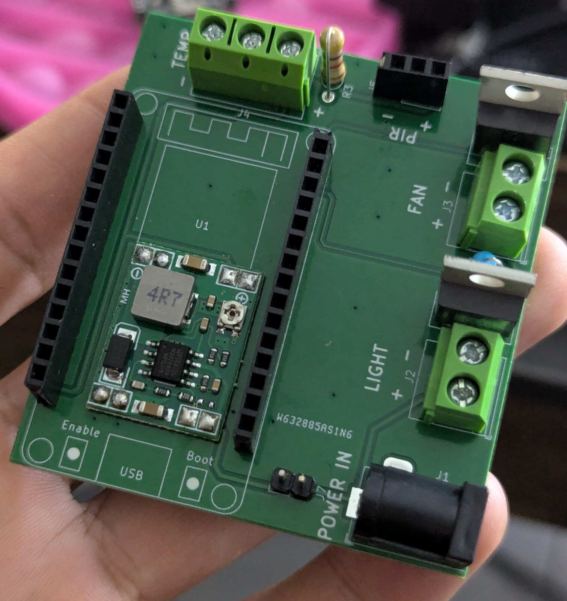
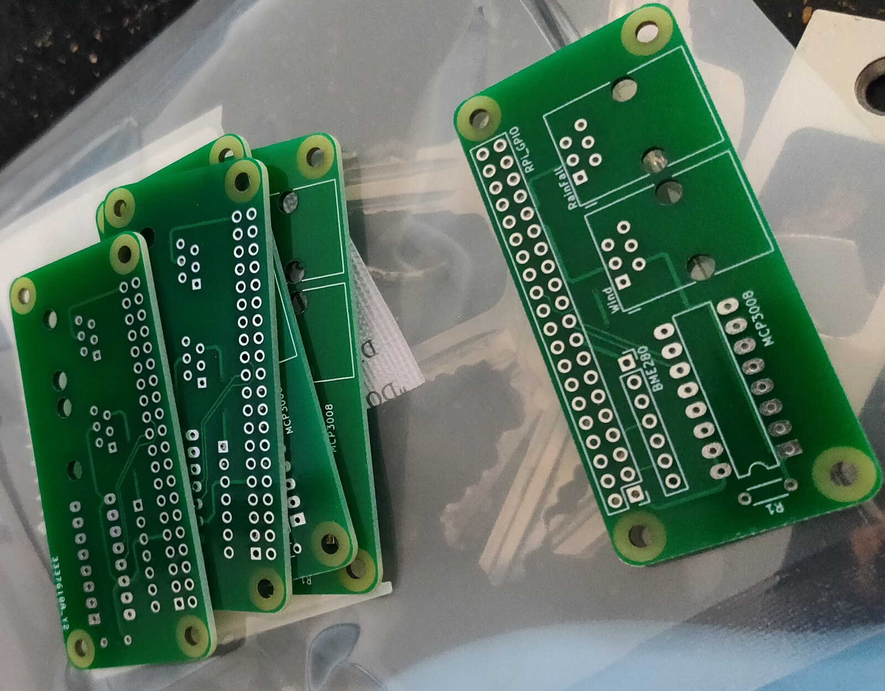
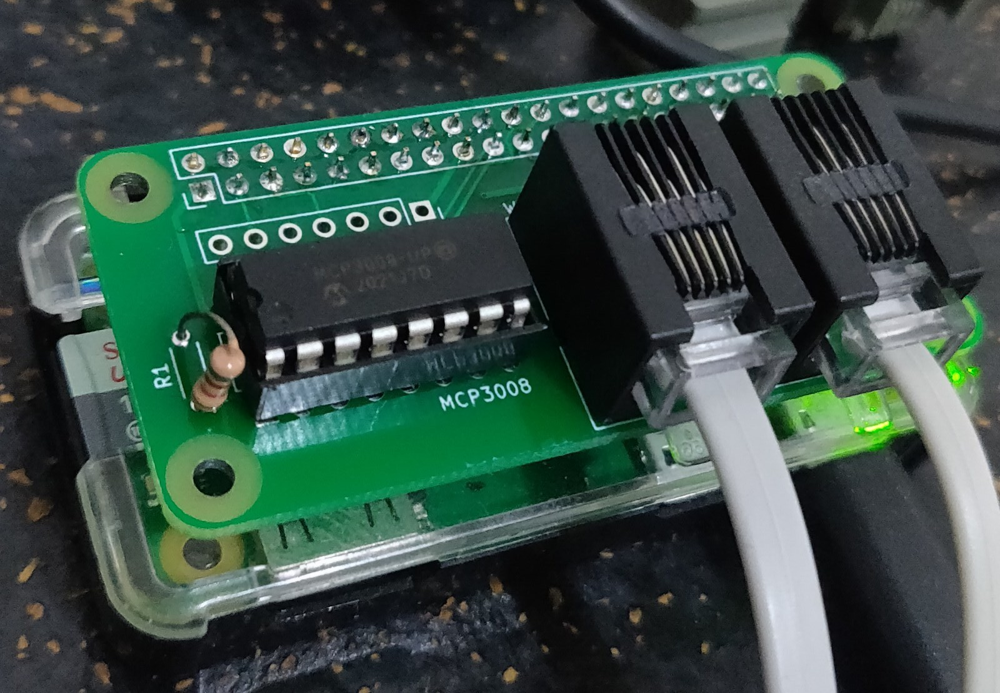
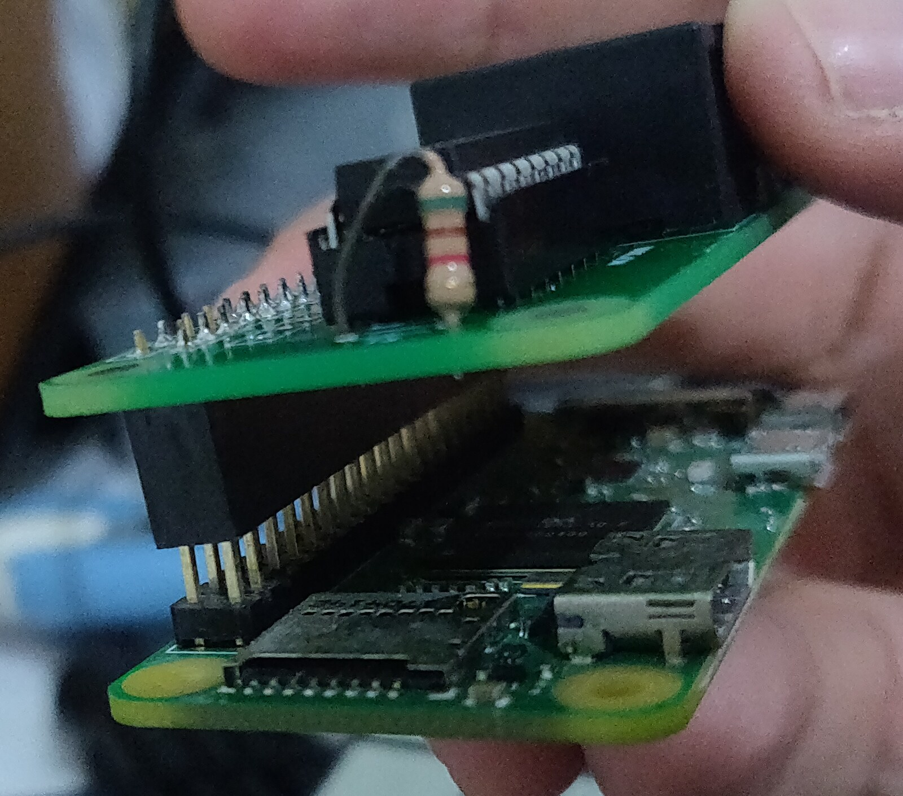
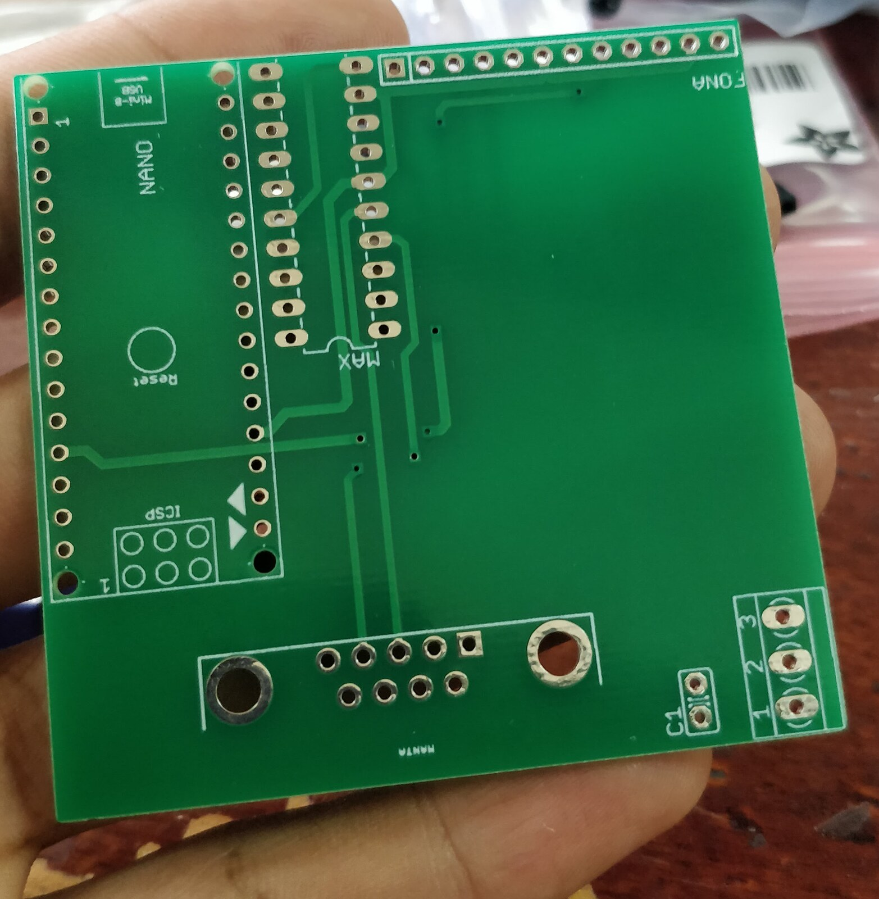
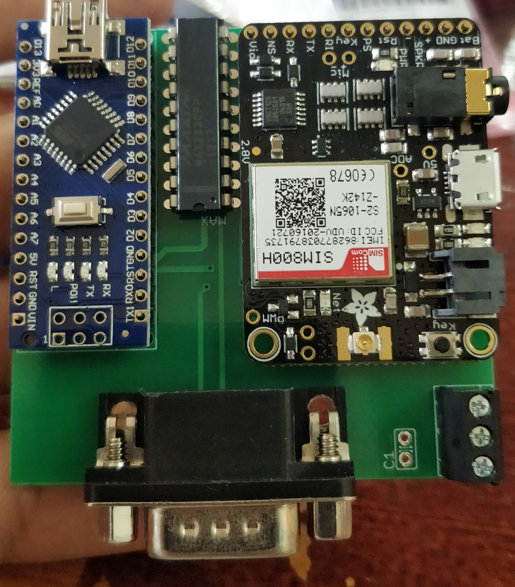

# PCB Design Portfolio

A selection of custom printed circuit boards I have designed and built, presented newest first. Each board was designed to solve a specific problem — a teaching platform, a weather station, and a remote water-quality monitor — rather than as a design exercise, and each one was fabricated and brought up in hardware.

---

## 1. ESP32 Sensor & Power Control Board

*Designed for the IoT course I teach at UWI.*

**Design files:** [KiCad schematic, layout, and project files →](https://github.com/irpl/ecse-simple-smart-hub-project-circuit)

This is the coursework platform board for the Internet of Things course I teach. It gives students a single board that covers the full loop of an IoT system: read the physical world, talk to a server, and act on the physical world in response.

An onboard **ESP32** reads a temperature sensor and a PIR motion sensor, and reports to a remote server. The server decides what should happen and instructs the ESP32, which then switches power through one of two **MOSFETs** to the corresponding output terminal. In other words, incoming power is routed to either of two loads under remote control — the two outputs are silkscreened `FAN` and `LIGHT`, which is the scenario students work through.

**Design notes**
- ESP32 devkit footprint (`U1`). The `Enable`, `Boot` and `USB` silkscreen marks where the devkit's own buttons and USB port land, so the board can be assembled and oriented correctly — they are markings, not broken-out pads.
- A landing footprint for an off-the-shelf **4.5–28 V** buck module (`J6`), so the board runs from any plain barrel-jack supply without designing a regulator onto it.
- Two low-side MOSFET switches (**IRLZ44N**, TO-220), each with a gate resistor. Logic-level parts were chosen deliberately: a standard MOSFET like the IRF-series needs several volts more than an ESP32's 3.3 V GPIO can supply to fully turn on, and would run hot in partial conduction. The IRLZ44N is fully enhanced from logic-level drive, so the ESP32 can switch real loads directly with no gate driver.
- Screw terminals for `TEMP`, `FAN` and `LIGHT`, a barrel jack for `POWER IN`, and a 3-pin header for the `PIR` — so students can wire and rewire the board without soldering.

The bare board and two populated builds are shown below — one with the ESP32 devkit soldered directly, and one built with female headers and a drop-in buck module so the ESP32 can be swapped out. Making the board survive a classroom full of students was as much a design constraint as the circuit itself.

| Bare board | Assembled | Socketed variant |
|---|---|---|
|  |  |  |

---

## 2. Raspberry Pi Zero Weather Station HAT

**Design files:** [fab-ready Gerbers, plus a schematic and layout reconstructed from the copper →](https://github.com/irpl/pi-zero-weather-hat-circuit) &nbsp;•&nbsp; **Firmware:** [pi-weather →](https://github.com/irpl/pi-weather)

A custom HAT for the Raspberry Pi Zero, built to drive a weather station kit I had bought a few years earlier. Rather than leave the circuit on a breadboard or commit it to perfboard, I designed a proper HAT for it.

I started from a basic Pi Zero HAT footprint found on GitHub, which gave me only the board outline, the four mounting holes, and the GPIO header. **Everything else on the board is my own design.**

**Design notes**
- A footprint for a **BME280** breakout provides temperature and humidity (not fitted in the photos below).
- An **MCP3008** ADC reads the kit's resistive wind vane, since the Pi has no analogue inputs of its own.
- Two **RJ11/RJ12 jacks** bring in the kit's wind and rainfall sensors — silkscreened `Wind` and `RainFall` — so the outdoor sensors plug in with standard cable instead of flying leads.
- Sized and drilled to sit on the Pi Zero as a proper HAT, so the finished unit stays compact enough to deploy.

Laid out in **KiCad** as a two-layer board and fabricated in November 2020. The [design files](https://github.com/irpl/pi-zero-weather-hat-circuit) include the exact Gerber and drill set sent to the fab, so the board is reproducible as-is.

The original KiCad project for this board was lost. The schematic and layout in that repo were **reconstructed from the Gerbers** — the netlist recovered from the copper itself, then cross-checked against the firmware — and are clearly labelled as such.

| Bare boards (fab batch) | Assembled, seated on a Pi Zero | HAT and Pi Zero (exploded) |
|---|---|---|
|  |  |  |

---

## 3. Water Quality Sensor Interface Board

**Design files:** [Eagle schematic and layout →](https://github.com/irpl/water-quality-sensor-circuit) &nbsp;•&nbsp; **Server:** [watermon — the listener this board uploads to →](https://github.com/irpl/watermon)

The oldest board here, built to get readings off a water quality sensor and onto a server with no wired network anywhere nearby.

The sensor speaks **RS-232**, which a microcontroller cannot read directly. On this board an **Arduino Nano** sits behind a **MAX233** transceiver that converts the sensor's incoming RS-232 signals down to TTL serial the Nano can read. The Nano then pushes that data to a remote server over the cellular network using a **SIM800** module with an ordinary SIM and data plan.

**Design notes**
- **MAX233** rather than the more common MAX232: it integrates the charge-pump capacitors, so the RS-232 level shifter needs no external capacitors at all — fewer parts to place and fewer things to fail in the field.
- **DB9 connector** on the board edge so the sensor plugs straight in with a standard serial cable.
- Footprints for the Arduino Nano and the Adafruit **SIM800** cellular module, plus a 2×3 ICSP header.
- Screw terminal for field power.

This one is essentially a protocol-and-transport bridge: a legacy serial instrument on one end, a cellular uplink on the other, and level translation in between.

The board was laid out in **Eagle** as a two-layer design; the [schematic and layout](https://github.com/irpl/water-quality-sensor-circuit) are available separately.

| Bare board | Assembled |
|---|---|
|  |  |

---

## About

These boards span roughly seven years of design work, from the RS-232-to-cellular bridge through to the current teaching platform. Across all three the common thread is designing boards to be **built, deployed, and maintained** — screw terminals and standard connectors instead of flying leads, off-the-shelf modules on plain header footprints so a failed part can be swapped, and part choices (like the MAX233) that cut the component count down — rather than boards that only work on the bench.

Happy to discuss any of them in more detail, including schematics and layout.
